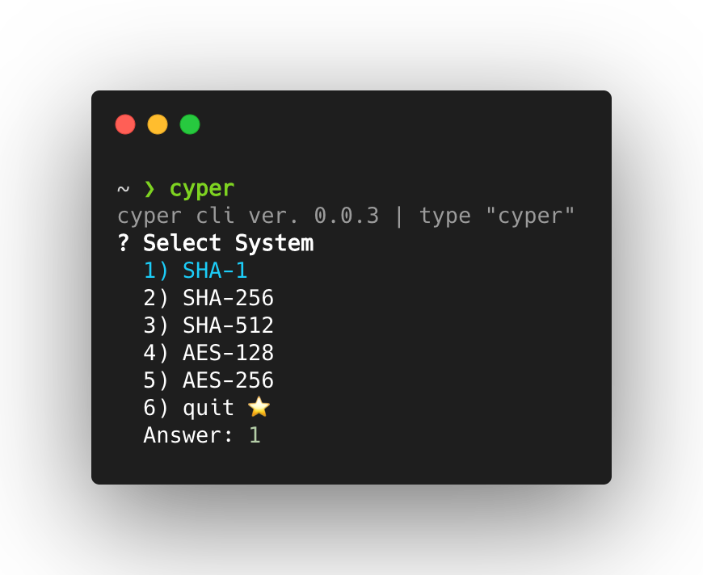
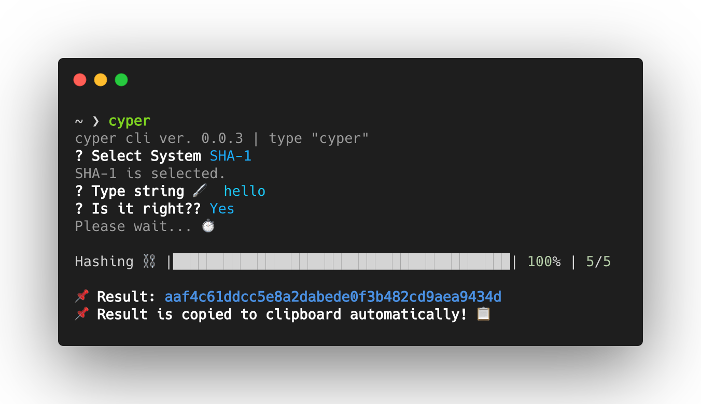
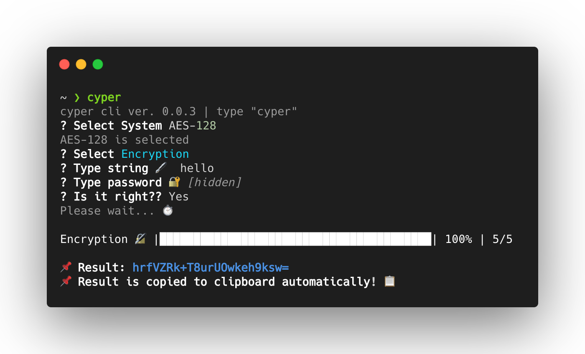
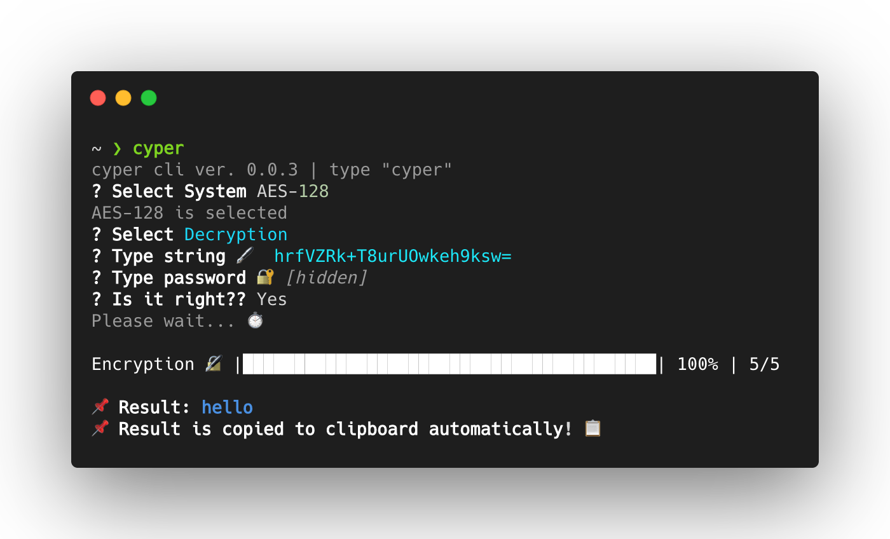

# 🔐 cyper.js
Encrypte and Decrypte in CLI!!
## 📝 Features
SHA-1, SHA-256, SHA-512, AES-128, AES-256

## 📥 Installation
### Download to install
[Click Here](https://github.com/wonjongin/cyperjs-2020/releases)
### npm
```
npm install -g @joing/cyperjs
```
### yarn
```
yarn global add @joing/cyperjs
```
### npx (It is not install)
```
npx @joing/cyperjs
```
## ⌨️ Usage 
Just Type "cyper"!!
```
Usage: cyper [option]

Options:
  -v, --version  output the version number
  -h, --help     display help for command
```
### Intro example


### SHA example


### AES encryption example


### AES decryption example

